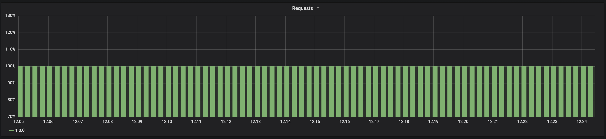
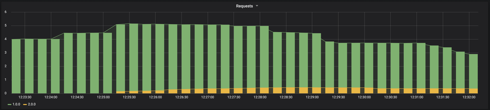
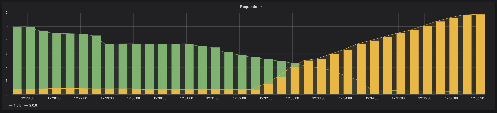

# Kubernetes Canary Deployment Example

Only to show how we can use canary deployment using only default components of Kubernetes. (It's a demo, if you think a better solution use Istio. I'll do a demo-app using Istio soon)

Using Ansible + AWS + Docker + Kubernetes + Helm + Grafana + Prometheus and one demo-app running OpenResty + Nginx with LUA script to expose metrics to Prometheus.

These playbooks will do:
- Install 03 Ubuntu instances EC2
- Install Docker all nodes
- Install kubeadm, kubectl and kubelet all nodes
- Create a Kubernetes cluster with 01 master and 02 workers
- Install helm
- Install Prometheus
- Install Grafana
- Create two images (Version 1.0.0 and 2.0.0) to run OpenResty + Nginx exposing the metrics to Prometheus
- Deploy in the k8s the app version 1.0.0 with ten replicas
- Deploy a canary deployment of app version 2.0.0 with 01 replicas (represent 10% of my service)
- Deploy the new version and remove the old one

Using canary deployment, you can deploy a new version of your app without downtime. For example, you can implement a new version of your app and split the request between both versions. You can redirect your requests where 10% go to the new version, and 90% go to the current version. So, you can check the stability of the latest release in the production environment, and after that, you can determine if you go to the new version in production or not.

Look an example of a dashboard with all requests to the app during deploy of the new version.

IMAGEHERE

### Prerequisites

You need to install Ansible in your computer and have an account into AWS. If you need to run it in another cloud your need to change the provisioning playbook.

To create the instance is needed that you set two environment variables, AWS_SECRET_ACCESS_KEY and AWS_ACCESS_KEY_ID, with your AWS account info.

```
export AWS_ACCESS_KEY_ID="SHDJSJHDJBNTTS"
export AWS_SECRET_ACCESS_KEY="hSs8s8282kkdbJzUdddd/ss/o+ser"
```

Install PIP:

```
curl https://bootstrap.pypa.io/get-pip.py -o get-pip.py
python get-pip.py
```

Install boto3 and ansible:

```
pip install ansible
pip install boto3
```

You need also have a key pair file, for example my-key-pair.pem, that is used to connect into your AWS instances.

### Installing

After you create the variables, you need to clone this repo.

```
git clone <repo>
```

Access the playbook directory:

```
cd k8s-canary-deploy-example/provisioning-playbook/
```

Open the file roles/common/vars/main.yml, and edit any option that you like, for example, the name of your key pair file from AWS.

```
instance_type: t2.medium #type of instance
security_group: giropops-cluster #name of security group that will be created
image: ami-0d2505740b82f7948 #ami Ubuntu 18.04 TLS official
keypair: my-key-pair.pem #your key pair file
region: us-east-1 # region that will be created the instances
count: 3 #number of instances
```

Load your key pair "my-key-pair.pem" that you specified in the in the var file using ssh-keyscan.

```
ssh-add path/of/my-key-pair.pem
```

Execute the playbook:

```
ansible-playbook -i hosts main.yml
```

When the playbook finishes, you can check in hosts file the IP of new instances:

```
cat hosts
[local]
localhost ansible_connection=local ansible_python_interpreter=python gather_facts=False

[giropops]
IP_EXTERNAL-NODE1
IP_EXTERNAL-NODE2
IP_EXTERNAL-NODE3
IP_INTERNAL-NODE1
IP_INTERNAL-NODE2
IP_INTERNAL-NODE3

```
Great! You have 03 new instances created in your AWS account. 
Now, you need to get the IPs and fill the hosts inventory file that exists inside the all other playbooks, like the example below:

```
cat hosts
[k8s-master]
IP_EXTERNAL-NODE1

[k8s-workers]
IP_EXTERNAL-NODE2
IP_EXTERNAL-NODE3

[k8s-workers:vars]
K8S_MASTER_NODE_IP=IP_INTERNAL-NODE1
K8S_API_SERCURE_PORT=6443
```

After that, you need to go to the k8s-install-playbook directory:

```
cd k8s-canary-deploy-example/k8s-install-playbook/
```

Execute the playbook:

```
ansible-playbook -i hosts main.yml
```

Now you have a Kubernetes cluster with 03 nodes and Helm, Prometheus and Grafana installed.
You can check the Grafana port that is exposed in the master node.

```
kubectl get services -n monitoring
```

To access grafana, use you IP_EXTERNAL-NODE:NODEPORT in your browser.

```
user: admin
password: admin
```

Create a new data source to get metrics from Prometheus

```
Name: Prometheus Server
Type: Prometheus
Url: http://IP_INTERNAL-NODE1:9090
Access: Server
```

Save and Test!

Now, let's go to create a dashboard.

```
Type: Graph
Query sum(rate(nginx_http_requests{app="giropops"}[5m])) by (version)
Legend : {{version}}
Draw Modes: Bars
Stack
Percent
```
Save!

Now, in another terminal execute the command to simulate request the app and let it run to generate requests to us visualize in the Grafana dashboard :

```
while true; do curl http://54.162.92.118:32222/ ; done
```


Let's deploy the app version 1.0.0:

```
cd k8s-canary-deploy-example/deploy-app-v1-playbook/
```

Execute the playbook:

```
ansible-playbook -i hosts main.yml
```

Now, you can see the output of curl that you start to receive a message:

```
Giropops App - Version 1.0.0
```

Let's keep the app version 1.0.0 running for 15 minutes, only collect data enough to our Grafana dashboard, like this:




Now, let's deploy the canary deployment of app version 2.0.0. In this example, we have ten replicas running the version 1.0.0, so, we need to deploy the canary deployment that will represent around 10% of the number of replicas of the app. Now we will have ten replicas running the version 1.0.0 e only one replica running 2.0.0.
In other words, we will have 90% of the requests to 1.0.0 and 10% of all requests arriving in the version 2.0.0.

Let's deploy the canary deployment:

```
cd k8s-canary-deploy-example/canary-deploy-app-v2-playbook/
```

Execute the playbook:

```
ansible-playbook -i hosts main.yml
```

Let's keep the app both versions running for 15 minutes, only to collect more data to our Grafana dashboard.




Ok, everything is right and working with our new version. Now, we want to replace entire the version 1.0.0 by the version 2.0.0.


Let's to deploy the app version 2.0.0:

```
cd k8s-canary-deploy-example/deploy-app-v2-playbook/
```

Execute the playbook:

```
ansible-playbook -i hosts main.yml
```





Great! Now we have the new version running in production and the best part, using canary deployment to prevent downtime of our app.


### TODO LIST
- Create a PV and a PVC to Grafana and Prometheus
- Create a pipeline using Jenkins/Gitlab
- Create new dashboards
